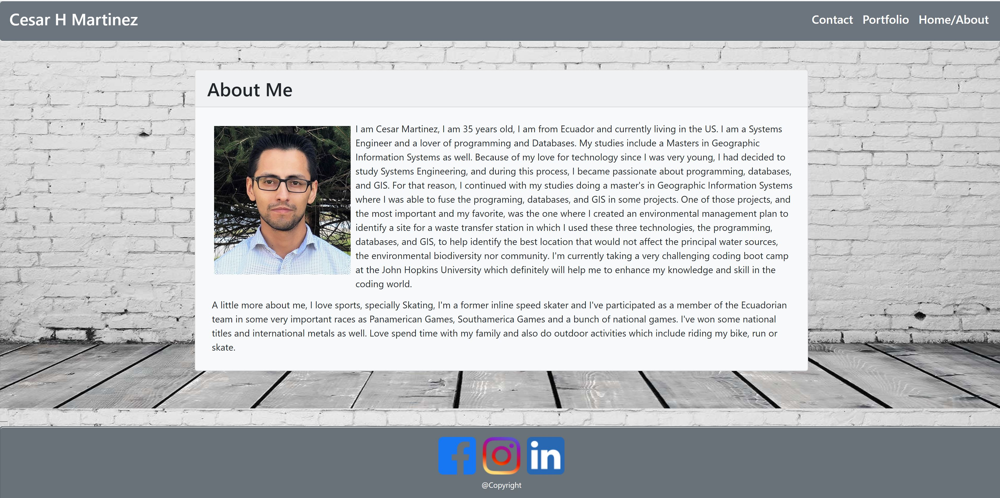
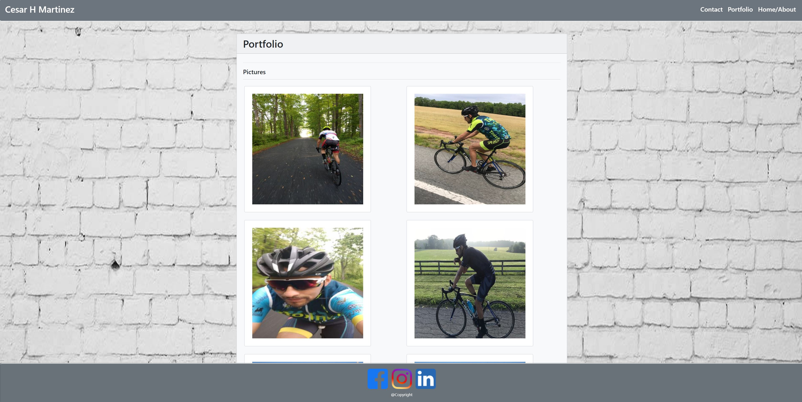

# Responsive Portfolio

The principal scope of this project is the creation of a responsive portfolio ensuring it renders well on different devices and window sizes. In this project, I have implemented bootstrap's grid system, components, and the use of Html validation to ensure the page has valid HTML code. 
[Click here to Access Portfolio](https://chernanma.github.io/Responsive-Portfolio/)

---

## Bootstrap's Grid System 

Bootstrap’s grid system uses a series of containers, rows, and columns to layout and align content. It’s built with flexbox and is fully responsive.

List of most common classes used to develop a webpage using bootstrap'grid system are:

- class="container"
- class="row"
- class="col-md-12"

Some of the rules that need to be noted when creating a website using bootstrap Grid System are:

- Rows must be placed within a .container (fixed-width) or .container-fluid (full-width) for proper alignment and padding
- Use rows to create horizontal groups of columns
- Content should be placed within columns, and only columns may be immediate children of rows
- Predefined classes like .row and .col-sm-4 are available for quickly making grid layouts
- Columns create gutters (gaps between column content) via padding. That padding is - offset in rows for the first and last column via negative margin on .rows
- Grid columns are created by specifying the number of 12 available columns you wish to span. For example, three equal columns would use three .col-sm-4
- Column widths are in percentage, so they are always fluid and sized relative to their parent element

Reference: [Bootstrap Grid System](https://www.w3schools.com/bootstrap/bootstrap_grid_system.asp#:~:text=Bootstrap's%20grid%20system%20allows%20up,span%201)

---
## Some Screenshots

### Home/About in Small Screen

### Contact in Small Screen

### Portfolio in Large Screen

